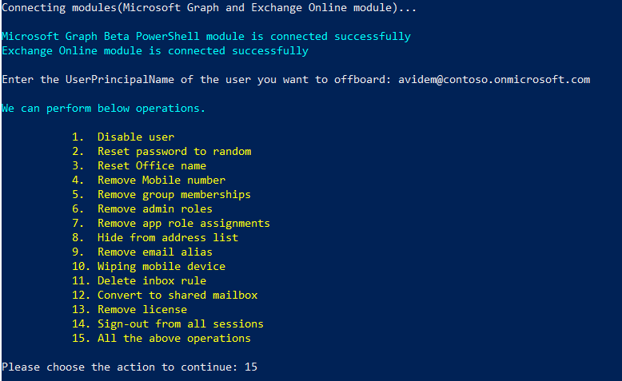
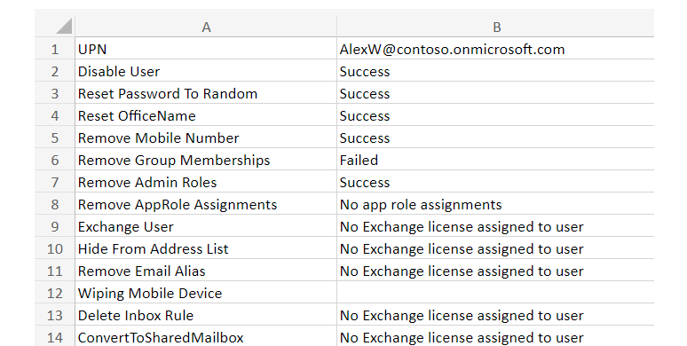

Automate Microsoft 365 User Offboarding with PowerShell
Try this quick, secure, and comprehensive PowerShell script to automate Microsoft 365 user offboarding.

Sample Output:

This script automates the user offboarding process and exports an output CSV file based on the action performed and its successful completion. The output of the PowerShell script looks similar to the screenshot below.